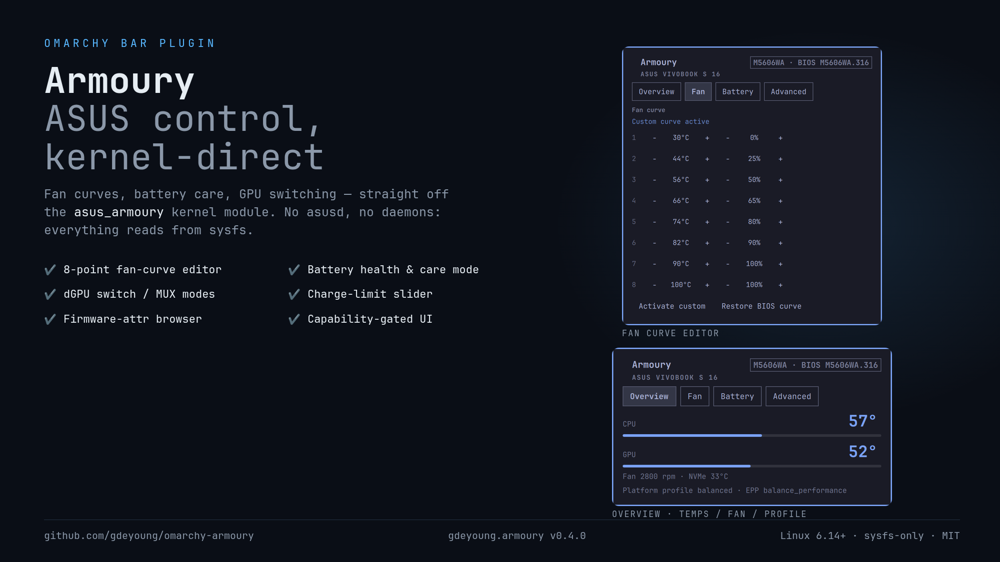

# Omarchy Armoury



ASUS laptop control in the [Omarchy](https://omarchy.org/) bar — built on the
kernel's `asus_armoury` module (Linux 6.14+), not `asusctl`. Zero daemons,
zero dependencies: everything reads straight from sysfs.

```
▎69° 󰋇        ← CPU temp chip (green < 75°, amber ≥ 75°, red ≥ 90°), click for the panel
```

Named for the kernel module it drives: `asus_armoury`. Works on any ASUS
laptop whose firmware exposes attributes under
`/sys/class/firmware-attributes/asus-armoury/` (Vivobook, Zenbook, ROG).

## Panel

G-Helper-inspired layout, four tabs (Overview / Fan / Battery / Advanced):

- **Overview** — big CPU (Tctl) and GPU readouts with proportional level bars (green → amber ≥ 75° → red ≥ 90°); fan RPM, NVMe temp, platform profile below
- **Fan** — 8-point fan-curve editor (temperature → duty %) on machines that expose the asus-wmi fan-curve interface (`pwm1_auto_point` hwmon, kernel 5.17+): nudge any hump, validate, then *Activate custom* or *Restore BIOS curve*. Capability-gated — machines without it say so plainly instead of faking it
- **GPU mode** — Hybrid / Integrated / Ultimate selector on machines that expose `dgpu_disable` / `gpu_mux_mode` (G-Helper semantics: Integrated = dGPU off for battery, Ultimate = dGPU drives the panel). Applies at next reboot. Hidden on iGPU-only machines
- **Battery** — health & wear (full ÷ design capacity), ASUS charge-care mode (Standard / Balanced / Maximum lifespan) via the firmware `charge_mode` attribute, live status/draw/cycles, charge threshold
- **Advanced** — charge-limit slider, and every attribute the module exposes, read-only (future attributes appear automatically)
- **Identity** — model, board, BIOS version; a banner when a firmware change is waiting on reboot

Writes (care mode, charge limit, GPU mode, fan curve) go through a
polkit-gated helper (`pkexec`) — the shell pops a native password prompt,
remembered for the session. The widget is fully functional read-only without
it.

Bar chip modes (middle click cycles, or set in the plugin settings UI):
temperature / profile / fan rpm / icon only. Right click forces a refresh.
Left click opens the panel.

## Why not asusctl?

`asusctl`/`asusd` fights `power-profiles-daemon` over `platform_profile`
(both want to own it), and its headline features — fan curves, per-key RGB,
GPU MUX — need ROG hardware this plugin's target machines don't have. The
kernel module exposes the same firmware knobs directly. If you already run
asusd, don't install both writers; use that instead.

Power profiles themselves are left to PPD (and whatever widget drives it) —
this plugin displays the active profile but doesn't set it.

## Install

```bash
git clone https://github.com/gdeyoung/omarchy-armoury.git
cd omarchy-armoury
./install.sh                  # widget: installs + enables, read-only
omarchy restart shell
```

Optional write support (battery care mode):

```bash
sudo bash helper/install-helper.sh   # installs /usr/local/bin/omarchy-armoury-helper + polkit action
```

The helper is a strictly whitelisted writer: `charge-mode 0|1|2`,
`charge-limit 20..100`, `gpu-disable 0|1`, `gpu-mux 0|1`, `fan-mode 0|1`, and
`fan-point temp|pwm <1-8> <value>` are the only things it can do. The widget
works read-only without it.

## Uninstall

```bash
sudo rm -f /usr/local/bin/omarchy-armoury-helper /usr/share/polkit-1/actions/org.omarchy.armoury.policy
omarchy plugin remove gdeyoung.armoury
omarchy restart shell
```

## How it works

Same stateless-probe architecture as
[omarchy-sysmon](https://github.com/gdeyoung/omarchy-sysmon): `armoury.sh`
prints one JSON line (attributes, battery threshold, fan, temps, profile,
identity) on a timer; the widget parses it with a pure `Model.js` that also
runs under `node --test`. Writes are validated client-side, then executed by
the polkit helper, then re-read.

## License

MIT
